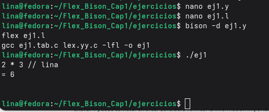
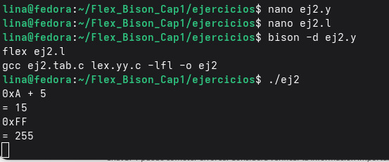
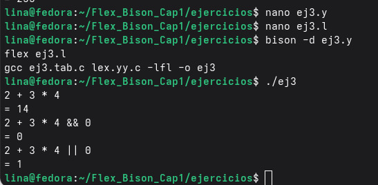
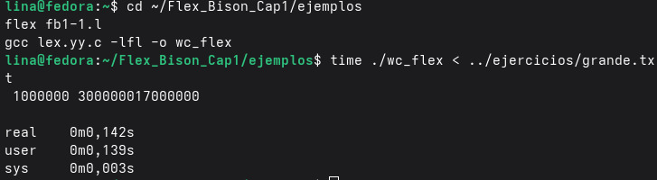
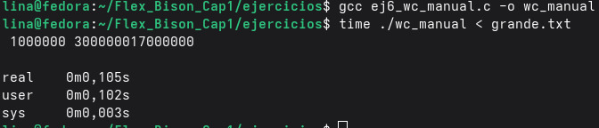

# Flex & Bison – Capítulo 1  

---

## Objetivo General

Implementar y analizar los ejemplos 1–5 del Capítulo 1 del libro *Flex & Bison*, y resolver los ejercicios 1–6 incluyendo modificaciones prácticas y análisis conceptual.  

El desarrollo se realizó en entorno Linux (Fedora) utilizando herramientas estándar de compilación.

Herramientas utilizadas:

- flex 2.6.4  
- bison 3.8.2  
- gcc 15.2.1  

---

## Ejemplos Implementados

### fb1-1 – Word Count

Implementación básica de conteo de líneas, palabras y caracteres usando Flex.

---

### fb1-2 – English to American

Scanner que reemplaza palabras específicas del inglés británico por su equivalente americano.

---

### fb1-3 – Scanner básico de calculadora

Reconocimiento de números y operadores simples.

---

### fb1-4 – Scanner con tokens

Implementación de tokens con valores numéricos asociados.

---

### fb1-5 – Calculadora con Flex y Bison

Integración completa entre analizador léxico (Flex) y analizador sintáctico (Bison).

---

## Ejercicios

### Ejercicio 1 – Línea con solo comentario

#### Pregunta  
¿Acepta la calculadora una línea que contenga solo un comentario?

#### Análisis  

La gramática original es:

calclist: calclist exp EOL

El parser siempre espera una expresión antes del fin de línea.  
Si la línea contiene únicamente un comentario, el scanner no devuelve tokens válidos para reducir a `exp`, generando error sintáctico.

#### Solución  

Se agregó una regla para permitir líneas vacías:

Imagen de Ejecución

---

### Ejercicio 2 – Soporte para números hexadecimales

El scanner original solo reconoce números decimales:

[0-9]+

Se agregó una nueva regla antes de la decimal:

0x[0-9a-fA-F]+

Conversión realizada con:

strtol(yytext, NULL, 16);

La modificación corresponde al análisis léxico (Flex).

Imagen de ejecución:

---

### Ejercicio 3 – Operadores lógicos && y ||

Se agregaron operadores lógicos respetando precedencia:

1. Multiplicación y división  
2. Suma y resta  
3. AND lógico (&&)  
4. OR lógico (||)  

Si se agrega | genera ambiguedad porque  ABS es |.

Imagen de ejecución:

---

### Ejercicio 4 – Comparación entre scanner manual y Flex

Ambos scanners reconocen los mismos tokens en entradas correctas, pero no son estrictamente equivalentes. Flex garantiza automáticamente el matching más largo mediante un DFA generado, mientras que el scanner escrito a mano depende de la implementación manual del programador, lo que puede producir diferencias en casos límite y EOF.

---

### Ejercicio 5 – Limitaciones de Flex

Flex está basado en expresiones regulares y autómatas finitos, por lo tanto solo puede reconocer lenguajes regulares.

No es suficiente para:

- Lenguajes sensibles a indentación (ejemplo: Python)  
- Estructuras anidadas arbitrarias  
- Situaciones dependientes de contexto  
- Lenguajes no regulares  

En estos casos es necesario un parser (Bison).

### Ejercicio 6 – Word Count manual vs Flex

Se reescribió el programa Word Count sin utilizar Flex, implementándolo manualmente en C usando `getchar()` y control de estados.

#### Prueba de rendimiento

Archivo de prueba: 1.000.000 de líneas.

Resultados medidos con el comando `time`:
Versión Flex:

Versión Manual en C:

Flex:
0.142 s

Manual:
0.105 s

La versión manual fue ligeramente más rápida.

